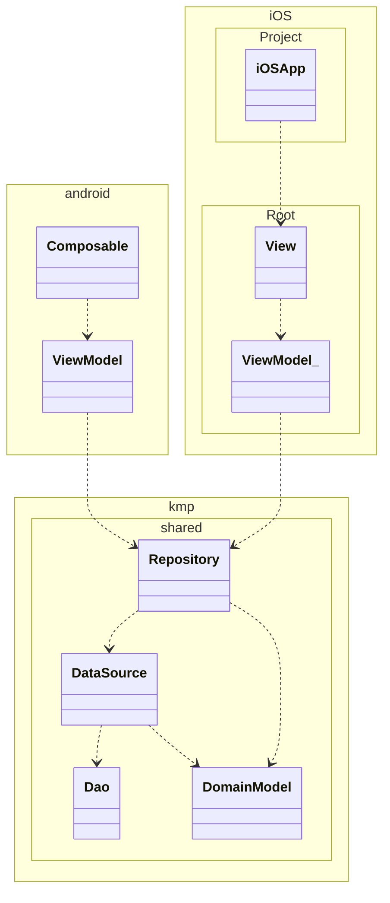

# ReadMe
## このアプリは何？
このアプリはAndroid/iOS向けの家計簿アプリです。食費や光熱費などの日々の出費を記録、閲覧できます。Kotlin Multiplatformという技術を利用することで、ビジネスロジックの実装をAndroid/iOSで共有している点が特徴です。


## 動作環境
このアプリは以下の環境で動作します
Android: SDKバージョン24以上
iOS: iOS 16以降


## 環境構築
### ※注意
こちらのプロジェクトはKotlin Multiplatformを用いています。そのためmaxOS上でしかビルドできません

### 動作確認環境
開発者は以下の環境で動作確認しています

PC: macOS Sequoia バージョン15.0.1 (チップ: Apple M2)
Android Studio: Android Studio Ladybug | 2024.2.1 Patch 1
XCode: バージョン16.0
Java: openjdk version "23.0.1" 2024-10-15
Kotlin Plugin(Android Studioのプラグイン): 242.23339.11.2421.12483815-AS
Kotlin Multiplatform Plugin(Android Studioのプラグイン): 0.8.3(242)-5
Mint: 0.17.5

### 環境構築方法
#### 0. 事前準備、kdoctorのインストール(オプション)
Kotlin Multiplatform(KMP)の環境構築を助けるツールとしてkdoctorというツールがあります。これはPCの環境を調べてKMP実行に必要なツールがインストールされているかを確認するためのものです。Homebrewを使って以下のコマンドでインストールすることができます
```bash
brew install kdoctor
```
インストール後、以下のコマンドでkdoctorを実行できます。実行するとKotlin Multiplatformを実行するのに必要なものが準備されているかどうかリストアップしてくれます
```bash
kdoctor
```
注意：kdoctorを実行するとCocoaPodsがインストールされているかどうか表示されますが、本プロジェクトではCocoaPodsは利用していないのでインストールする必要はありません。

#### 1. Kotlin Multiplatform環境の構築
リンク先の公式サイトの記述を参考にしながら以下の4つをインストールしてください
https://www.jetbrains.com/help/kotlin-multiplatform-dev/multiplatform-setup.html#possible-issues-and-solutions

1. Kotlin / Android Studio
2. Java / JDK
3. XCode
4. Kotlin Multiplatform plugin / Kotlin plugin

#### 2. Mint / SwiftLintの導入
本プロジェクトではswift側のLinterとしてSwiftLintを導入しており、iOS側のプロジェクトをビルドする際にSwiftLintを実行するように設定しています。そのためiOS側のビルドにはSwiftLintが必要になります。本プロジェクトではコマンドラインツールのパッケージマネージャーであるMintを使ったSwiftLintをインストールすることを想定しています。
まず以下のコマンドでMintをインストールします
```bash
brew install mint
```

次にプロジェクトのルートディレクトリ(Mintfileのあるディレクトリ)で以下のコマンドを実行します
```bash
mint bootstrap
```

## アプリのビルド
### KMPのビルド環境の指定
ビジネスロジック部分を実装したKMPは各OSのビルド環境とは独立して存在します。プロジェクトのルートディレクトリにあるgradle.propertiesファイル内にある以下の部分の記述を書き換えることでKMPのビルド環境を変えることができます
```
#BuildKonfig
## dev, release
buildkonfig.flavor=dev
```
buildkonfig.flavorにdevを指定すると開発用のインスタンスでビルドされます。`buildkonfig.flavor=dev`の場合、ユーザが入力したデータはモバイル端末のオンメモリで保存されるようになり、アプリをキルすると状態がリセットされます。`buildkonfig.flavor=release`の場合、ユーザが入力したデータはモバイル端末のファイルに保存されるため、アプリをキルしたあとも状態が永続化されるようになります。

#### 注意
本プロジェクトの構成では各OSのビルド環境とKMP部分の実装のビルド環境は同期しません。例えばAndroid側のBuildVariantをreleaseに変更してもgradle.propertiesの値をreleaseに書き換えない限り、ユーザ入力データは永続化されない設定になります。

### Androidアプリのビルド
特別な手続きは必要ありません。Android Studioから一般のAndroidアプリをビルドするときと同じようにビルドしてください

### iOSアプリのビルド
まず初めにKMP部分の実装をXCFrameworkにビルドする必要があります。プロジェクトのルートディレクトリで以下のコマンドを実行してKMP部分のビルドを行ってください
```bash
./gradlew assembleXCFramework
```

上記コマンド実行後XCodeからiOSアプリのビルドを行ってください。assembleXCFrameworkコマンドの実行はkmp側の実装に修正を加えるたびに実行する必要があります。そうしなければkmp側の修正内容がXCode側に反映されません。

### その他: kotlin側のlinter実行
kotlin側ではswift側と異なりビルドのたびにlinterを走らせる設定にはしていません。linterの実行を行いたい場合は以下のコマンドをプロジェクトのルートディレクトリで実行してください
```bash
./gradlew ktlintFormat
```


## アプリの設計
### モジュール構成
※図は説明を補足するためのものであり正確ではありません。



### GUIアーキテクチャについて
本プロジェクトはAndroid/iOS側両方で一般的なMVVMパターンを採用しています。ViewについてはAndroid側はJetpack Composeを、iOS側ではSwiftUIを利用しています。ViewModelが用いるデータはRepository層から得られます。Repository層はDomainModelをViewModelに提供する役割やローカル/リモートのアクセス先の管理、キャッシュ機構などを担います。DataSource/Dao層はデータへのアクセス方法の抽象化を担います。

### KMPで共有する部分
本プロジェクトではRepository、DataSource, Dao, DomainモデルをKMPで実装することでAndroid/iOSで共有しています(sharedモジュール)。sharedモジュールはXCFrameworkとしてビルドされてiOS側のプロジェクトで利用されます。

### iOS側のマルチモジュール化
pbxprojファイルのコンフリクトを防ぐためにiOSApp.swiftを除く全てのファイルをSwiftPackageManagerで管理する体制にしています。KMP部分の実装はSwiftPackagerManagerのbinaryTargetとしてプロジェクトに取り込まれています。

### 検討したけれど採用しなかった構成
- ViewModelの共通化は行いませんでした。ViewModelを共通化すると各OSのView側の都合で状態の持ち方を変えようとしても修正が難しいためです
- 本プロジェクトではそれぞれのOSごとにViewModelが1つだけ使っており、画面ごとにViewModelを用意しませんでした。この理由は実装効率です。画面数が少ないことがわかっていたので実装工数を削減するためにこのような構成を取りました

## 各画面のスナップショット画像
### Android
### iOS

## 未実装項目
時間的な制約により以下の項目が未実装状態になっています
- Android/iOSでTop画面でPull to Refreshできない
- iOSではデータを作成日でフィルタリングする機能が実装されていない
- Android/iOSで明細のカテゴリを追加したり修正したりする機能を実装していない(Repository層にのみ実装がある状態)

